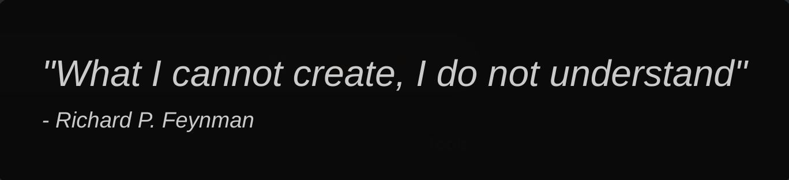

  

    
  

   
  
  

 

## About Me
:triangular_ruler: **Education:** Computer Science undergraduate at the University of Wollongong *(based in Singapore, via SIM GE)*

:computer: **Editor:** VSCode

:penguin: **OS:** I use ~~Arch~~ Linux Mint, btw

I am a CS student who enjoys creating interactive and visually-engaging simulations. 

## *Non-exhaustive* list of projects/langauges
<table align="center">

  <!-- Headers -->
  <tr>
    <th>Programming Language</th>
    <th>Library/Framework</th>
    <th>Project</th>
  </tr>

  <!-- C++ -->
  <tr>
    <td>
      
    </td>
    <td>
       
      
    </td>
    <td>
      <ul>
        <li><a href="https://www.youtube.com/watch?v=dbthJvaGqBU">Softbody Physics Simulation</a> </li>
        <li><a href="https://www.youtube.com/watch?v=ysKY90w-4r8">Convex Hull Visualizer</a></li>
        <li><a href="https://www.youtube.com/watch?v=tg9Nu65zjOE">Conway's Game of Life</a> </li>
      </ul>
    </td>
  </tr>

  <!-- C# -->
  <tr>
    <td>
      
    </td>
    <td>
      
    </td>
    <td>
      <ul>
        <li><a href="https://www.youtube.com/watch?v=eF0pfnKq1GU">Octree Visualization</a> </li>
        <li><a href="https://www.youtube.com/watch?v=wWmGYGnthO8">Into The Horde</a></li>
        <li><a href="https://www.youtube.com/watch?v=Zktsre0W2rY&t=1s">BloxFace: The Prequel</a> </li>
      </ul>
    </td>
  </tr>

  <!-- Typescript/React/NodeJS -->
  <tr>
    <td>
       
    </td>
    <td>
       
       
       
      
    </td>
    <td>
      <ul>
        <li><a href="https://pet-heaven-9fbb4-68150.firebaseapp.com/">Pet Heaven</a> </li>
        <li><a href="https://yet-another-wordle-clone.netlify.app/">(Yet Another) Wordle Clone</a></li>
      </ul>
    </td>
  </tr>

  <!-- HTML/CSS/JS -->
  <tr>
    <td>
      
      
      
    </td>
    <td></td>
    <td>
      <ul>
        <li><a href="https://azoom-car-rentals.netlify.app/">AZoom Car Rentals</a> </li>
      </ul>
    </td>
  </tr>

  <!-- Java -->
  <tr>
    <td>
      
    </td>
    <td>
       
    </td>
    <td></td>
  </tr>
</table>

## Tools/Technologies I've used

  
  
  
  
  

          

          
