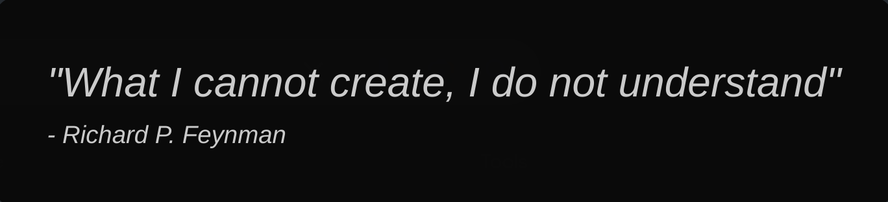

  

    
  

   
  
  

 

## About Me
:triangular_ruler: **Education:** Computer Science undergraduate at the University of Wollongong *(based in Singapore, via SIM GE)*

:computer: **Editor:** VSCode

:penguin: **OS:** I use ~~Arch~~ Linux Mint, btw

I am a CS student who enjoys creating interactive and visually-engaging simulations. 

          
